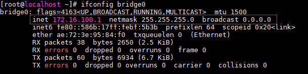
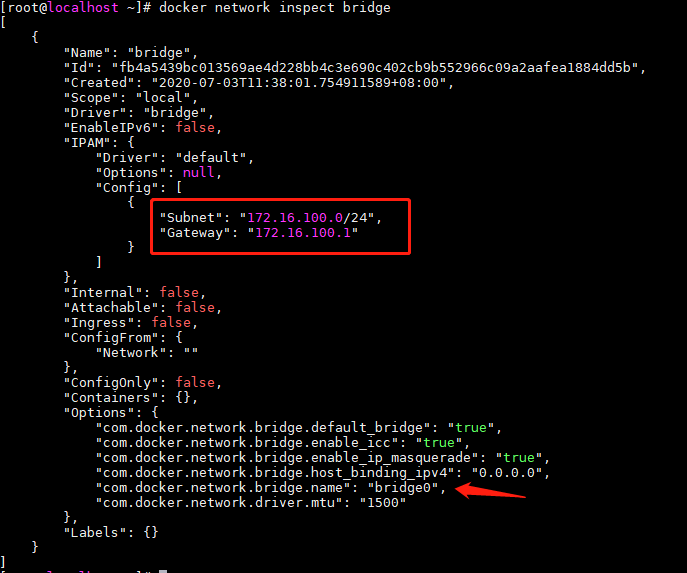
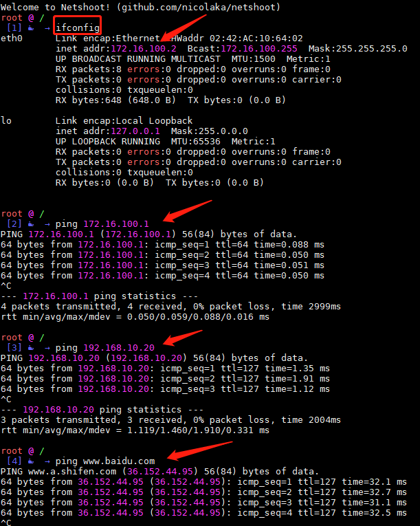
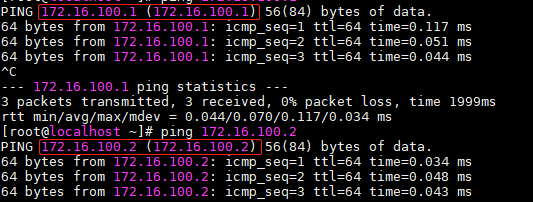
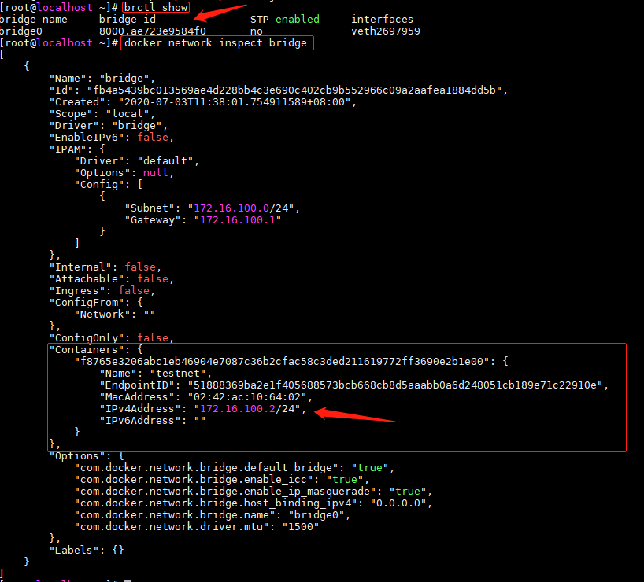

# CentOS7 容器环境删除默认网桥Docker0，采用自定义网桥进行通讯

作者 lyc  
 2020 年 07月 03日    

### 前言

Docker在启动容器镜像实例之后，默认是采用网桥的模式与外界进行通讯，详细参考官网说明[^docker官方网络配置说明] 


### 适用场景

> 1.Docker容器安装到VMware 虚拟机的CentOS7之后,启动的容器实例无法访问宿主主机IP，更无法访问外网，宿主主机也无法访问容器IP。通过堡垒机访问Docker也有可能出现类似问题。(CentOS7物理主机及云主机暂时没有发现此问题)  
> 2.业务场景需要采用自定义网桥进行容器网络管理  

### 操作步骤

#### 1.先删除默认网桥docker0

查看系统网桥(Linux网桥相关操作需要用到工具bridge-utils)

```bash
brctl show
```

!!! tip "提示"

    如果提示brctl命令不存在，则需要安装此工具:`yum install bridge-utils`,安装完成之后可以通过`brctl show`查看到默认网桥docker0


然后通过`ip link set dev`命令先关闭docker0,再通过`brctl delbr`命令进行删除即可

```sh
ip link set dev docker0 down
brctl delbr docker0
```


#### 2.添加自定义网桥bridge0

先停止容器

```sh
service docker stop
```

再添加网桥bridge0并设置IP地址段

```sh
brctl addbr bridge0
ip addr add 172.16.100.1/24 dev bridge0
```

启动网桥，查看自定义网桥信息

```sh
ip link set dev bridge0 up
ifconfig bridge0
```




#### 3.修改Docker守护进程配置

!!! tip "提示"

	docker自定义配置文件路径为/etc/docker/daemon.json,如果没有此文件,则需要创建它vim /etc/docker/daemon.json

添加配置项

```
"bridge":"bridge0"
```

配置结果如下(本机之前配置过加速镜像和私有仓库地址)


查看最新网桥名称，再没有启动容器之前bridge id 为`8000.00000000000`

```
brctl show
```


#### 4.检查网桥IP网关

重新启动docker服务


```bash
service docker start
```

查看docker bridge网络详情

```bash
docker network inspect bridge
```

 检查网桥配置是否为名称`bridge.name:"bridge0"`网络段`subnet：172.16.100.0/24`网关`Gateawy:172.16.100.1`




#### 5.测试联调容器网络是否正常

启动一个镜像进行容器网络调试，这里使用netshoot[^nicolaka/netshoot]镜像


```bash
docker run -it --rm --name testnet nicolaka/netshoot
```

运行容器之后，可直接进行对容器进行交互式命令操作，首先获取的ip地址信息

```sh
ifconfig
```

接下来在容器中进行 ==三连ping== ,验证网络是否正常通讯

一ping 网桥网关 `ping 172.16.100.1`

二ping 宿主主机IP或网关 `ping 192.168.10.20`(在VMware中的CentOS与真实机是NAT联网模式，可以直接ping本物理机的ip或网关)

三ping 外网地址 `www.baidu.com`

测试结果如下，容器内网和外网全部通讯正常



退出容器(输入`exit`),最后在宿主主机CentOS7中测试是否可以与容器实例通讯

ping 172.16.100.1 网桥网关  
ping172.16.100.2  容器实例IP  



也可以直接查看bridge0的id，查看刚刚启动的容器实例是否关联网桥


```bash
brctl show
```

!!! warning "注意"    
	如下图所示bridge id `8000.ae723e9584f0` , 如果bridge id 仍然是8000.00000，则要么没有启动容器实例，要么上面的步骤有误。


查看容器IP的方法，除了进入容器内部执行`ifconfig`查看`ip`以外(注意：有些容器镜像是没有集成网络命令的)，大部分情况下我们通过`docker network inspect`子命令查看与网桥关联的所有容器实例ip或 `docker inspect [容器id/name]`查看某个容器实例的ip

```
docker network inspect bridge
```




#### 6.外网不能访问容器内网的情况 

**调整防火墙访问规则或关闭防火墙**

如果宿主主机开启了防火墙,外网可能无法访问容器所暴露的端口，解决方案是开启防火墙相关端口即可,比如容器是一个web服务实例，外部与内部的端口映射关系为 ==8080:80== ,则宿主主机应该开启 ==8080== 端口访问规则，外网才可以访问容器内部的web服务.


### 总结

以上核心命令总结如下

```
ip link set dev docker0 down
brctl delbr docker0
service docker stop
brctl addbr bridge0
ip addr add 172.16.100.1/24 dev bridge0
ip link set dev bridge0 up
ifconfig bridge0
```

```
vim /etc/docker/daemon.json
"bridge":"bridge0"
```

```
service docker start
docker network inspect bridge
docker run -it --rm --name testnet nicolaka/netshoot
```

```
brctl show
docker network inspect bridge
```

!!! note ""

	本文分享内容适合开发工程师通过VMware来进行Docker容器化集成或测试环境部署，所遇到的问题也是本人反复查资料和不断折腾总结而来。专业的运维工程师应该可以解决**在VMware CentOS7中原有默认网桥docker0不work的情况**，期待有更好的解决方案。以下是参考引用地址：

[^docker官方网络配置说明]: docker官方网络配置说明 [Networking overview](https://docs.docker.com/network/), [Use bridge networks](https://docs.docker.com/network/bridge)
[^nicolaka/netshoot]: 开源Docker and Kubernetes network t络调试诊断工具 [nicolaka/netshoot](https://github.com/nicolaka/netshoot)
[^vilce博客]: Docker网桥模式ping不通宿主机 [地址](https://blog.csdn.net/qq_36059826/article/details/106550332)


