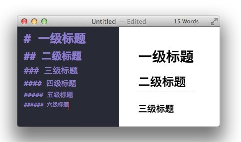
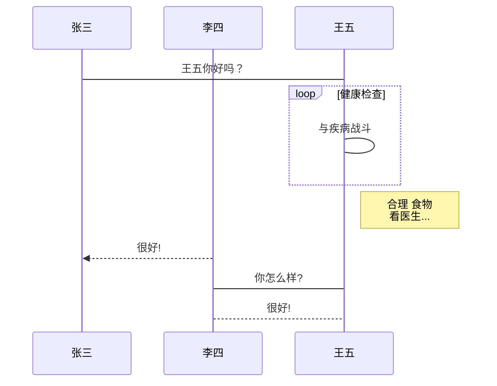
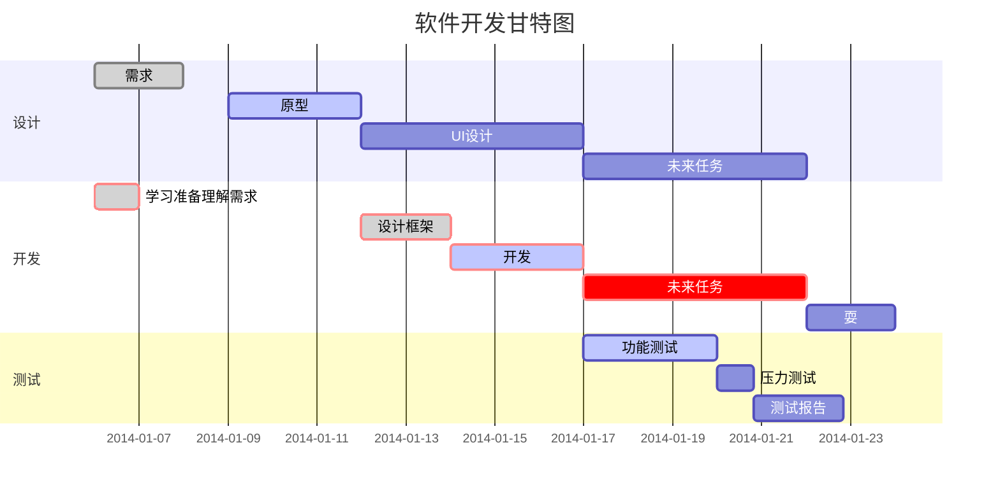

# Markdown教程

------


### 工具准备

首先准备一款markdown编辑器，在网上搜索一下关键字，可以搜索到很多，百度百科已有人列出清单 ：

常用的Markdown 编辑器

- **[VSCode](https://code.visualstudio.com/)(开发必备)**
- HBuilderX
- [Atom](https://baike.baidu.com/item/Atom/17542770)
- [Byword](https://baike.baidu.com/item/Byword)
- [Mou](https://baike.baidu.com/item/Mou)
- **[Typora](https://www.typora.io/)(个人推荐用这款)**
- MacDown
- RStudio
- [Cmd Markdown](https://www.zybuluo.com/mdeditor)

### 常用语法

最常见的Markdown格式选项和键盘快捷键:

```markdown
以下是源示例
| 输出后的效果 | Markdown         | 快捷键             |
| ------------ | ---------------- 		| ------------------ |
| Bold         | **text**         		| Ctrl/⌘ + B         |
| *Emphasize*  | *text*             	| Ctrl/⌘ + I         |
| Link         | [title](http://xx) 	| Ctrl/⌘ + K         |
| Inline Code  | `code js html`         | Ctrl/⌘ + Shift + K |
| Image        | | Ctrl/⌘ + Shift + I |
| List         | * item          		| Ctrl + L           |
| Blockquote   | > quote         		| Ctrl + Q           |
| H1           | # Heading        		|                    |
| H2           | ## Heading      		| Ctrl/⌘ + H         |
| H3           | ### Heading      		| Ctrl/⌘ + H (x2)    |
```

结果示例：

| 输出后的效果       | Markdown         | 快捷键             |
| ------------------ | ---------------- | ------------------ |
| Bold 加粗          | **text**         | Ctrl/⌘ + B         |
| *Emphasize* 倾斜   | *text*           | Ctrl/⌘ + I         |
| Link 超连接        |[title](http://xxxxx) | Ctrl/⌘ + K         |
| Inline Code 代码块 | `code js html` | Ctrl/⌘ + Shift + K |
| Image 图片         |   | Ctrl/⌘ + Shift + I |
| List 列表          | * item           | Ctrl + L           |
| Blockquote 引用    | > quote          | Ctrl + Q           |
| H1一级标题         | # Heading        |                    |
| H2二级标题         | ## Heading       | Ctrl/⌘ + H         |
| H3三级标题         | ### Heading      | Ctrl/⌘ + H (x2)    |

### 文本样式

（带`*`星号的文本样式，在原版Markdown标准中不存在，但在其大部分衍生标准中被添加）

* 正常无标记文字
- 链接 :[Title](URL)

- 加粗 :**Bold**

- 斜体字 :*Italics*

- *****高亮 :==text==

- 段落 : 段落之间空一行

- 换行符 : 一行结束时输入两个空格

- 列表 :* 添加星号成为一个新的列表项。

- > 引用内容 :`> 引用内容`

- 内嵌代码 : `alert('Hello World');`

- 画水平线 (HR) :  -----(或连续输入三个星号 `***` 即可)

  ***

- 方框checkbox：- [ ]  

- [ ] 

### 字体与效果

标记：  
**粗字体** 和 *斜体* 和 `添加标签 `  
**`添加标签粗体 `** 
*`添加标签斜体`*  
我要删除之前写过的错误信息：~~我写错啦，删掉删掉~~  
<font color="green">我是原谅绿,我是和Html标签一起使用的</font>  
**<font color="green">我是加粗原谅绿</font>**  
正文无标记的文字  
*<font color="green">我是斜斜的原谅绿</font>*  
<font color="green">标签内添加<font color="red">Html</font>也有效果  </font>


```markdown
标记：  
**粗字体** 和 *斜体* 和 `添加标签`
**`添加标签粗体`**
*`添加标签斜体`*
我要删除之前写过的错误信息：~~我写错啦，删掉删掉~~
<font color="green">我是原谅绿,我是和Html标签一起使用的</font>
**<font color="green">我是加粗原谅绿</font>**
正文无标记的文字
*<font color="green">我是斜斜的原谅绿</font>*
<font color="green">标签内添加<font color="red">Html</font>也有效果</font>
```

### 标题

标题能显示出文章的结构。行首插入1-6个 # ，每增加一个 # 表示更深入层次的内容，对应到标题的深度由 1-6 阶。

- H1 :**# Header 1**

- H2 :**## Header 2**

- H3 :**### Header 3**

- H4 :**#### Header 4**

- H5 :**##### Header 5**

- H6 :**###### Header 6**

  
  

#### 标题效果  

共有6个级别的标题

```markdown
标记：
#一级标题
##二级标题
###三级标题
####四级标题
#####五级标题
######六级标题
```



### 生成目录

```csharp
标记：
[TOC]
```

### 文字引用

> 鲁迅说过，吃饭拌肉汁，吃嘛嘛香  
> 拿破仑说过，不喜欢吃麻辣烫的士兵不是好士兵


```markdown
标记：
>鲁迅说过，吃饭拌肉汁，吃嘛嘛香
>拿破仑说过，不喜欢吃麻辣烫的士兵不是好士兵
```

另外引用是可以嵌套的，一个 **>** 符号是最外层，两个 **>** 符号是第一层嵌套，以此类推：

```markdown
> 最外层
> > 第一层嵌套
> > > 第二层嵌套
```

显示结果如下：

> 最外层
> > 第一层嵌套
> >
> > > 第二层嵌套

### 段落首行缩进

首行缩进这个有必要说一说，markdown主要面向英文文档，所以没有特殊的'首行缩进'语法。在文本编辑器里面我们一般用一个`Tab`键，再不济就用`空格`，我们来看一下`Tab`和`空格`在markdown中的效果。

**Tab键的效果：**
这是`Tab`键产生的效果;不要怀疑，我确实加了一个Tab键，但是他喵的怎么看不到效果呢。还有，请勿乱用2个`Tab`键，2个`Tab`键绝不会出现缩进的效果，下面会说到2个`Tab`键是代码块。就像下面这样：

如果你离上一行之间有一行空行，那么2个`Tab`键就是一块代码块。不要怀疑，这就是一块代码块，这块代码块的背景是有淡淡的灰色的，如果你看不到，那可能是你显示器太亮了，代码块里面``(也就是我们添加标签的效果，也不会生效的)

**空格键的效果：**
这是空格键的效果;好像也没有效果

上面的两种方法都没有效果，现在告诉大家一个方法。很简单，加上``就好(简书不支持，很多blog都不支持)

**真正的首行缩进**
这是真的首行缩进哦。


```undefined
标记：
       这是真的首行缩进哦。
```

### 链接

```
1、链接到网站`
如果想要调用链接[百度](http://www.baidu.com),格式是`[显示内容](链接地址)
```
[百度](http://www.baidu.com)


```cpp
2、图片连接
展示图片的标记格式也和链接到网站的标记格式差不多
标记


```

- 开头一个感叹号 !

- 接着一个方括号，里面放上图片的替代文字

- 接着一个普通括号，里面放上图片的网址，最后还可以用引号包住并加上选择性的 'title' 属性的文字。

- Markdown 还没有办法指定图片的高度与宽度，如果你需要的话，你可以使用普通的  标签。

  ```html
  
  ```


```markdown
3、连接引用变量
这个链接用 1 作为网址变量 [Google][1]
这个链接用 baidu 作为网址变量 [baidu][baidu]
然后在文档的结尾为变量赋值（网址）

  [1]: http://www.google.com/
  [baidu]: http://www.baidu.com/
```

这个链接用 1 作为网址变量 [Google][1]
这个链接用 baidu作为网址变量 [baidu][baidu]
然后在文档的结尾为变量赋值（网址）

[1]: http://www.google.com/
[ baidu]: http://www.baidu.com/	"百度"

### 列表

#### `1、无序的列表`

- -生成的列表
  - 子列表1(前面有一个Tab)
  - 我(前面有一个Tab)
    - 很(前面有两个Tab)
      - 好(前面有三个Tab)
        - 看(前面有四个Tab)
    - 不好看
  - 子列表2

- *生成的列表1
- *生成的列表2

- +生成的列表1
- +生成的列表2

```
-、*、+`可以生成列表的符号,`-、*、+`后要加上`空格`才会生效，子列表前面要加上`Tab`键,生成子列表的关键就是加上`Tab
```

```
标记：
- -生成的列表
    - 子列表1(前面有一个Tab)
    - 我(前面有一个Tab)
        - 很(前面有两个Tab)
            - 好(前面有三个Tab)
                - 看(前面有四个Tab)
        - 不好看
    - 子列表2
* *生成的列表1
* *生成的列表2
+ +生成的列表1
+ +生成的列表2
```

------

#### `2、有序的列表`

1. 有序列表一(文字前面有空格哦)
   (1).我是子列表，但是我没有层级效果
2. 有序列表二
3. 有序列表三

数字加上`.`再加上`空格`，就变成了有序的列表。

```undefined
标记：
1. 有序列表一(文字前面有空格哦)
    (1).我是子列表，但是我没有层级效果
2. 有序列表二
3. 有序列表三
```

#### `3、有序有层级列表`

- 1.有序列表一
  - 1.1 我是子列表，我有层级效果
  - 1.2
- 2.有序列表二
- 3.有序列表三
  哈哈，这是我自己想出来的，无序列表上加上数字；如果真的是要数字区分就可以这么做。

```css
标记：
- 1.有序列表一
    - 1.1 我是子列表，我有层级效果
    - 1.2 
- 2.有序列表二
- 3.有序列表三
```

------

### 表格

| 星期 | 1              | 2          | 3          | 4        | 5        | 6        | 7        |
| ---- | -------------- | ---------- | ---------- | -------- | -------- | -------- | -------- |
| 早餐 | 香蕉牛奶燕麦粥 | 皮蛋瘦肉粥 | 蜂蜜小蛋糕 | 灌汤包   | 南瓜饼   | 肉末蛋羹 | 豆浆油条 |
| 中餐 | 爆炒鸡肝       | 笋干炒肉   | 箩卜炒肉   | 剁椒鱼头 | 葱油蛏子 | 风味蹄筋 | 珍珠丸子 |
| 晚餐 | 牛肉砂锅       | 虾皮炒海带 | 牛肉炒西芹 | 芝麻豆腐 | 香菇炒肉 | 土豆丝饼 | 叉烧肉   |

```ruby
标记：
|星期|1|2|3|4|5|6|7|
|---|---|---|---|---|---|---|---|
|早餐|香蕉牛奶燕麦粥|皮蛋瘦肉粥|蜂蜜小蛋糕|灌汤包|南瓜饼|肉末蛋羹|豆浆油条|
|中餐|爆炒鸡肝|笋干炒肉|箩卜炒肉|剁椒鱼头|葱油蛏子|风味蹄筋|珍珠丸子|
|晚餐|牛肉砂锅|虾皮炒海带|牛肉炒西芹|芝麻豆腐|香菇炒肉|土豆丝饼|叉烧肉|
```

### 转义

Markdown 使用了很多特殊符号来表示特定的意义，如果需要显示特定的符号则需要使用转义字符，Markdown 使用反斜杠转义特殊字符：

```
**文本加粗** 
\*\* 正常显示星号 \*\*
```

**文本加粗** 
\*\* 正常显示星号 \*\*

### 代码块

代码块可能由于网站的支持不同，会有不同的效果，但是代码块有三种书写的方式

#### `1、Tab代码块`

代码区块使用 **4 个空格**或者一个**制表符（Tab 键）**。

实例如下：


显示结果如下：

#### 

#### `2、加强代码块`

你也可以用 **```** 包裹一段代码，并指定一种语言（也可以不指定），技术人编写示例代码的必备标签

```go
标记
​```
加强的非特定语言的代码块
HTML
JS
C# JAVA 
​```
```

```
加强的非特定语言的代码块
HTML
JS
C# JAVA 
```

特定的的代码块也可能由于网站的支持不同，会有不同的颜色高亮效果，也就是加上代码块的名字如````java`

```java
​```java
 public static void main(String[] args){
     System.out.println("这是java语言代码块");
 }
​```     
```

效果

```java
public static void main(String[] args){
    System.out.println("这是java语言代码块");
}
```

#### `3、扩展代码块`

其它扩展格式块,如````flow`，这是流程图的代码块，直接生成流程图(需要第三方支持)

**流程图样例**

~~~markdown
```flow
st=>start: 开始框
op=>operation: 处理框
cond=>condition: 判断框(是或否?)
sub1=>subroutine: 子流程
io=>inputoutput: 输入输出框
e=>end: 结束框
st->op->cond
cond(yes)->io->e
cond(no)->sub1(right)->op
```
~~~

```flow
st=>start: 开始框
op=>operation: 处理框
cond=>condition: 判断框(是或否?)
sub1=>subroutine: 子流程
io=>inputoutput: 输入输出框
e=>end: 结束框
st->op->cond
cond(yes)->io->e
cond(no)->sub1(right)->op
```


**UML标准时序图样例**

~~~markdown

~~~


**UML时序图源码复杂样例：**

```markdown

​```sequence
Title: 标题：复杂使用
对象A->对象B: 对象B你好吗?（请求）
Note right of 对象B: 对象B的描述
Note left of 对象A: 对象A的描述(提示)
对象B-->对象A: 我很好(响应)
对象B->小三: 你好吗
小三-->>对象A: 对象B找我了
对象A->对象B: 你真的好吗？
Note over 小三,对象B: 我们是朋友
participant C
Note right of C: 没人陪我玩
​```
```

```sequence
Title: 标题：复杂使用
对象A->对象B: 对象B你好吗?（请求）
Note right of 对象B: 对象B的描述
Note left of 对象A: 对象A的描述(提示)
对象B-->对象A: 我很好(响应)
对象B->小三: 你好吗
小三-->>对象A: 对象B找我了
对象A->对象B: 你真的好吗？
Note over 小三,对象B: 我们是朋友
participant C
Note right of C: 没人陪我玩
```

**甘特图样例**

~~~markdown

~~~


更多语法参考：[流程图语法参考](https://link.jianshu.com/?t=http://adrai.github.io/flowchart.js/)

特定的代码块能生成很多图形如`序列图`、`甘特图`等等，请看[Cmd Markdown](https://www.zybuluo.com/mdeditor?url=https://www.zybuluo.com/static/editor/md-help.markdown#7-流程图)、[mdadvance](https://www.runoob.com/markdown/md-advance.html)

### 公式

当你需要在编辑器中插入数学公式时，可以使用两个美元符 $$ 包裹 TeX 或 LaTeX 格式的数学公式来实现。提交后，问答和文章页会根据需要加载 Mathjax 对数学公式进行渲染。如：

```
$$
\mathbf{V}_1 \times \mathbf{V}_2 =  \begin{vmatrix} 
\mathbf{i} & \mathbf{j} & \mathbf{k} \\
\frac{\partial X}{\partial u} &  \frac{\partial Y}{\partial u} & 0 \\
\frac{\partial X}{\partial v} &  \frac{\partial Y}{\partial v} & 0 \\
\end{vmatrix}
${$tep1}{\style{visibility:hidden}{(x+1)(x+1)}}
$$
```

$$
\mathbf{V}_1 \times \mathbf{V}_2 =  \begin{vmatrix} 
\mathbf{i} & \mathbf{j} & \mathbf{k} \\
\frac{\partial X}{\partial u} &  \frac{\partial Y}{\partial u} & 0 \\
\frac{\partial X}{\partial v} &  \frac{\partial Y}{\partial v} & 0 \\
\end{vmatrix}
${$tep1}{\style{visibility:hidden}{(x+1)(x+1)}}
$$

> 本文参考引用网址：  
> https://www.jianshu.com/p/9219979a33e1  
> https://www.runoob.com/markdown  


