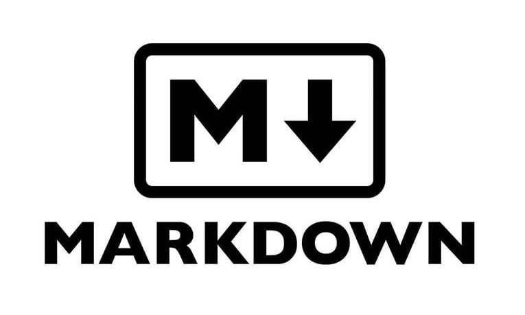

# 首页


欢迎来到Markdown的世界，接下来让我们一感受Markdown 带来的纯文本格式编写文档的魅力。

### MK介绍

**Markdown(简称MK)** 是一种轻量级标记语言，通过简单的标记语法，撰写具有可读性文章、博客和技术文档，这种格式的文档编写方便，让人更加专注内容的同时，也能轻松排版。
Markdown 语言在 2004 由约翰·格鲁伯（英文博客：[John Gruber][0]）创建。


### MK特点

Markdown 编写的文档后缀为 **.md**, **.markdown**。
Markdown 编写的文档可以导出 HTML 、Word、图像、PDF、Epub 等多种格式的文档。

Markdown简洁的语法，轻松编写带格式的文字，先感受一下：

#### 1. 斜体和粗体

使用 * 和 ** 表示斜体和粗体。

示例：

这是 *斜体*，这是 **粗体**。

#### 2. 分级标题

使用 === 表示一级标题，使用 --- 表示二级标题。

示例：

```
这是一个一级标题
============================

这是一个二级标题
--------------------------------------------------

### 这是一个三级标题
```

你也可以选择在行首加井号表示不同级别的标题 (H1-H6)，例如：# H1, ## H2, ### H3，#### H4。

#### 3. 外链接

使用 \[描述](链接地址) 为文字增加外链接。

示例：

这是去往 [github](http://github.com) 的链接。

#### 4. 制作一份待办事宜 [Todo 列表](https://www.zybuluo.com/mdeditor?url=https://www.zybuluo.com/static/editor/md-help.markdown#13-待办事宜-todo-列表)

- [ ] 支持以 PDF 格式导出文稿
- [ ] 改进 Cmd 渲染算法，使用局部渲染技术提高渲染效率
- [x] 新增 Todo 列表功能
- [x] 修复 LaTex 公式渲染问题
- [x] 新增 LaTex 公式编号功能

#### 5. 书写一个质能守恒公式[^LaTeX]

$$E=mc^2$$

#### 6. 高亮一段代码[^code]

```python
@requires_authorization
class SomeClass:
    pass

if __name__ == '__main__':
    # A comment
    print 'hello world'
```

### MK书籍

《了不起的Markdown》：

- [京东](https://item.jd.com/12669274.html) 
- [当当](http://product.dangdang.com/27912444.html)

引用书籍中的推荐

> Markdown优雅高效，能够极速排版。
>
> 它适用于多个平台，其中包括Github、微信公众号、简书、知乎、CSDN、印象笔记、有道云笔记、熊掌记、腾讯文档、石墨文档等
>
> 使用它你可以真正享受「一处编写，随处使用」的便捷
>
> 每个人都需要写作
>
> 如果你比较「懒」，既不想花太多时间在排版上，又希望版面好看
>
> 那么不管是写博客文章、写项目文档、技术文档、写书、记笔记、写邮件、写幻灯片、写协作文档、写交互式文档，还是想拥有自己的博客
>
> 你都得先找一个得心应手的「兵器」
>
> 而 Markdown可以让你专注写作，专注思考
>
> 让你「心中无尘，码字入神」
>
> 让你的写作进入「禅模式」

**接下来我们开始MK学习之旅吧！**



[0]:http://daringfireball.net/projects/markdown/	"创始人 John Gruber 的 Markdown 博客"
[1]: http://google.com/        "Google"
[2]: http://search.yahoo.com/  "Yahoo Search"
[3]: http://search.msn.com/    "MSN Search"

[^LaTeX]: 支持 **LaTeX** 编辑显示支持，例如：$\sum_{i=1}^n a_i=0$， 访问 [MathJax][4] 参考更多使用方法。

[^code]: 代码高亮功能支持包括 Java, Python, JavaScript 在内的，**四十一**种主流编程语言。

